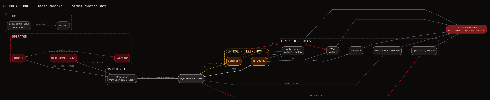

<p align="center"></p>

# Legion Control

[](https://www.gnu.org/licenses/old-licenses/gpl-2.0.html) [](https://www.rust-lang.org/)

Linux control software for Lenovo Legion laptops: a GTK4/libadwaita app, CLI, privileged hardware daemon, and optional KDE Plasma 6 widget.

[Install](docs/INSTALLATION.md) · [Usage](docs/USAGE.md) · [Hardware & HID](docs/HARDWARE-AND-HID.md) · [Troubleshooting](docs/TROUBLESHOOTING.md) · [Report an issue](https://github.com/encomjp/lenovo-legion-tool/issues)

> **Experimental software:** community-developed and provided without warranty. Hardware-writing features can affect system or device state; use them only when you understand their effect and have a recovery plan. Legion Control is not affiliated with Lenovo.

## Features

- Monitor CPU, GPU, battery, fans, and supported hwmon telemetry.
- Control profiles, fan targets, CPU boost, SMT, charge limits, and **CPU Tuning** — thermal throttle (max-temp governor, 70–98°C) + Curve Optimizer undervolt + 5-min stability test on one tab (chips on top, controls below, hover tips, `--hidden` tray autostart).
- Configure supported Gen 10 Spectrum RGB zones, effects, brightness, logo, and per-key colors.
- Save profiles, automate supported controls with `legion-cli`, and use the optional Plasma 6 widget.

## Get started

The source installer supports Ubuntu 24.04+, Fedora 40+, Arch-family distributions, and the implemented openSUSE Tumbleweed dependency path. The GUI build requires Rust 1.87+, GTK 4.14+, libadwaita 1.5+, `libudev`, `pkg-config`, and a C toolchain.

```bash
git clone https://github.com/encomjp/lenovo-legion-tool.git
cd lenovo-legion-tool
./install.sh
```

Useful variants include `./install.sh -y`, `./install.sh --user`, `./install.sh --widget`, and `./install.sh --help`. Do not mix a native package installation with the source installer; see the [Installation Guide](docs/INSTALLATION.md) for packages, optional backends, upgrades, and removal.

After installation:

```bash
systemctl status legion-control
legion-cli status
legion-cli info
```

## How it works

The GUI, CLI, and widget talk to `legion-daemon` for privileged operations. The daemon combines Linux interfaces such as sysfs, hwmon, battery, NVIDIA telemetry, and HID, while selected RGB operations use a direct HID path. Device-specific support varies by model, firmware, kernel, drivers, and installation.

[](docs/assets/legion-control-overview.png)

[Open the architecture diagram as PNG](docs/assets/legion-control-overview.png) · [View the SVG source](docs/assets/legion-control-overview.svg) · [Read the Architecture Guide](docs/ARCHITECTURE.md)

## Alpha telemetry (opt-in)

Alpha builds can send **one anonymized JSON** report — hardware model/type/BIOS/CPU/GPU/EC, distro+kernel, sensors, fans, battery health, thermal/Curve-Optimizer settings, settings digest, sanitized daemon-log tail, self-check results — over encrypted HTTPS to the developer's collector ([`server/wan/`](server/wan/README.md)). The operator reviews reports in a web portal reachable only over Tailscale. **Off by default**, enabled in Setup; see the [privacy statement](server/wan/PRIVACY.md). Never included: hostname, username, serials, MAC/IP addresses. Self-hosters can run their own collector and point clients at it via `LEGION_TELEMETRY_URL`, sharing its secret through `LEGION_TELEMETRY_KEY`.

## Hardware support

The project is verified on the Lenovo Legion Pro 7 16AFR10H (machine type `83RU`) with a Gen 10 Spectrum RGB keyboard (`048d:c197`). `048d:c193` is a separate Lenovo Lighting controller covered by the udev rule, not the Spectrum implementation. Other Gen 10 Legion models are likely-compatible but not verified here; older generations use different RGB protocols. Check the controller before expecting Spectrum support:

```bash
lsusb -d 048d:c197
```

This identifies the Gen 10 Spectrum controller directly. `048d:c193` is a separate Lenovo Lighting controller covered by the udev rule, not the Spectrum implementation. See [Hardware and HID](docs/HARDWARE-AND-HID.md) for interface boundaries, device discovery, and safe diagnostics.

## Guides

- [Installation](docs/INSTALLATION.md) — prerequisites, source and native packages, installer options, widget setup, upgrades, and removal.
- [Usage](docs/USAGE.md) — GUI and CLI controls, profiles, cooling, lighting, battery, diagnostics, logs, and safety rules.
- [Architecture](docs/ARCHITECTURE.md) — components, IPC, hardware data flow, persistence, permissions, and deployment boundaries.
- [Hardware and HID](docs/HARDWARE-AND-HID.md) — Linux interfaces, HID lighting, hardware support boundaries, and debugging checks.
- [KDE Plasma widget](docs/WIDGET.md) — requirements, installation, controls, configuration, and validation.
- [Troubleshooting](docs/TROUBLESHOOTING.md) — evidence-first fixes for installation, daemon, HID, sensors, fans, dGPU, battery, and widget issues.
- [Development](docs/DEVELOPMENT.md) — toolchain, checks, packaging, hardware-sensitive testing, and contribution guidance.

## Project

Repository: <https://github.com/encomjp/lenovo-legion-tool>

Legion Control is licensed under [GPL-2.0-only](https://www.gnu.org/licenses/old-licenses/gpl-2.0.html). Spectrum protocol notes draw on community reverse-engineering work, including [legion-spectrum-control](https://github.com/alstergee/legion-spectrum-control) and [LenovoLegionToolkit](https://github.com/BartoszCichecki/LenovoLegionToolkit).
