<p align="center">
  
</p>

<h1 align="center">Legion Control</h1>

<p align="center">
  <b>Garage-lab console for Lenovo Legion — GTK4/libadwaita · Rust · Daemon · KDE widget</b><br>
  <sub>Unofficial · Community · Not affiliated with Lenovo · Made in Europe for everyone</sub>
</p>

<p align="center">
  <a href="https://www.gnu.org/licenses/old-licenses/gpl-2.0.html"></a>
  <a href="https://www.rust-lang.org/"></a>
  <a href="https://github.com/encomjp/lenovo-legion-tool/releases"></a>
  <a href="https://github.com/encomjp/lenovo-legion-tool/issues"></a>
  
  
</p>

<p align="center">
  <a href="docs/INSTALLATION.md"><b>Install</b></a> ·
  <a href="docs/USAGE.md">Usage</a> ·
  <a href="docs/HARDWARE-AND-HID.md">Hardware & HID</a> ·
  <a href="docs/TROUBLESHOOTING.md">Troubleshooting</a> ·
  <a href="https://github.com/encomjp/lenovo-legion-tool/issues/new">Report an issue</a>
</p>

<p align="center">
  
</p>

> **Experimental:** community-developed, no warranty. Hardware writes can affect system state — use with a recovery plan. Screenshots below are captured headless on an isolated `Xvfb :99 + openbox` session (`GDK_BACKEND=x11`, `GSK_RENDERER=cairo`) — your real desktop is never obscured.

---

### Hero — Home overview on Legion Pro 7 16AFR10H (83RU)

<p align="center">
  <a href="docs/assets/screenshots/01-home-overview.png">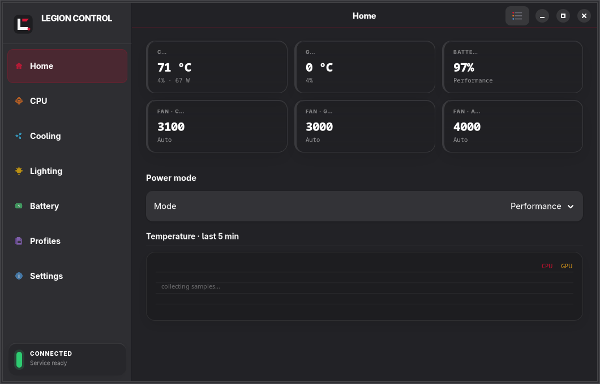</a><br>
  <sub><b>Home</b> · live chips · Fan overview · Battery · Custom PPT — 1060×680, dark libadwaita, captured offscreen</sub>
</p>

<p align="center">
  <a href="docs/assets/screenshots/05-cooling.png">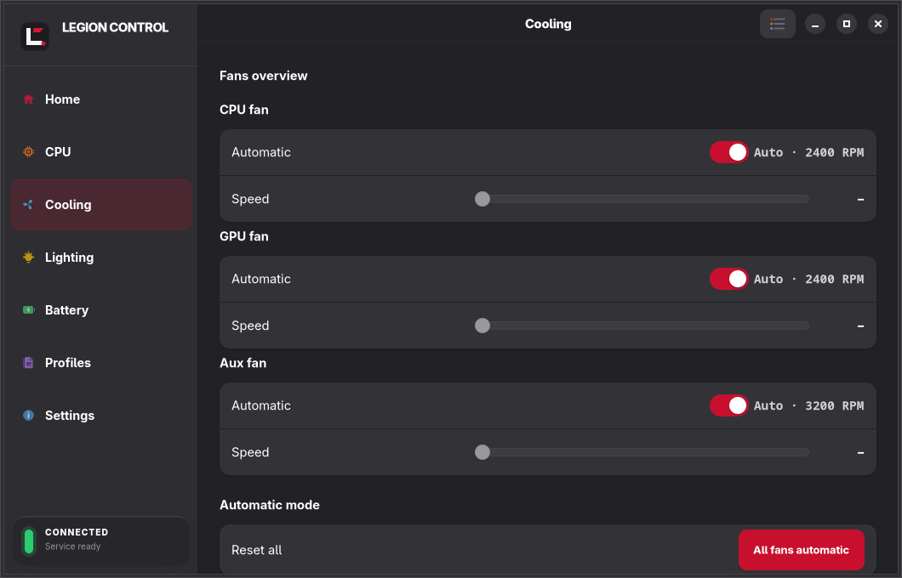</a>
  <a href="docs/assets/screenshots/06-lighting-keyboard.png">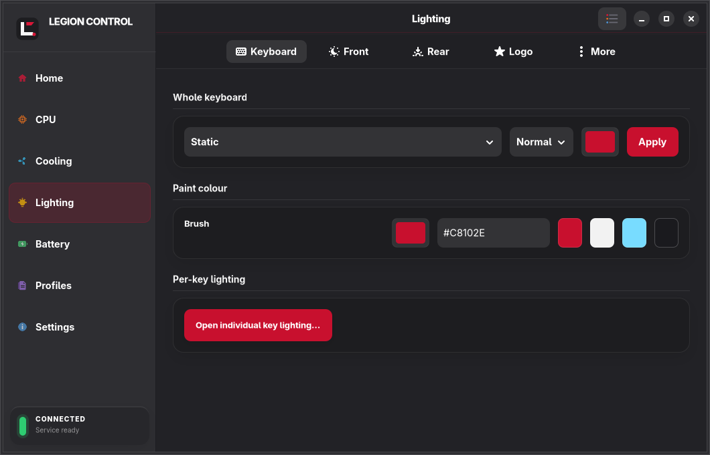</a>
  <a href="docs/assets/screenshots/11-battery.png">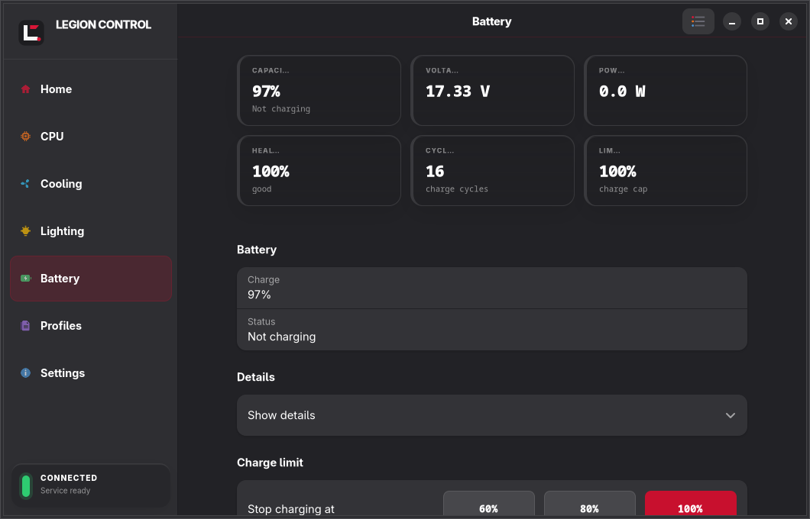</a>
</p>

---

## Screenshots — the whole app, no workflow interruption

> Every image is a **real 1060×680 window** rendered headless (`Xvfb 1400×900 + openbox`, `LEGION_PAGE=…`, `xwd`→`png`). No compositor grab of your live session — the session stays untouched. Click any thumbnail for full resolution.

<table>
<tr>
<td align="center"><a href="docs/assets/screenshots/01-home-overview.png"></a><br><b>Home</b><br><sub>chips · fans · battery</sub></td>
<td align="center"><a href="docs/assets/screenshots/02-cpu-features.png">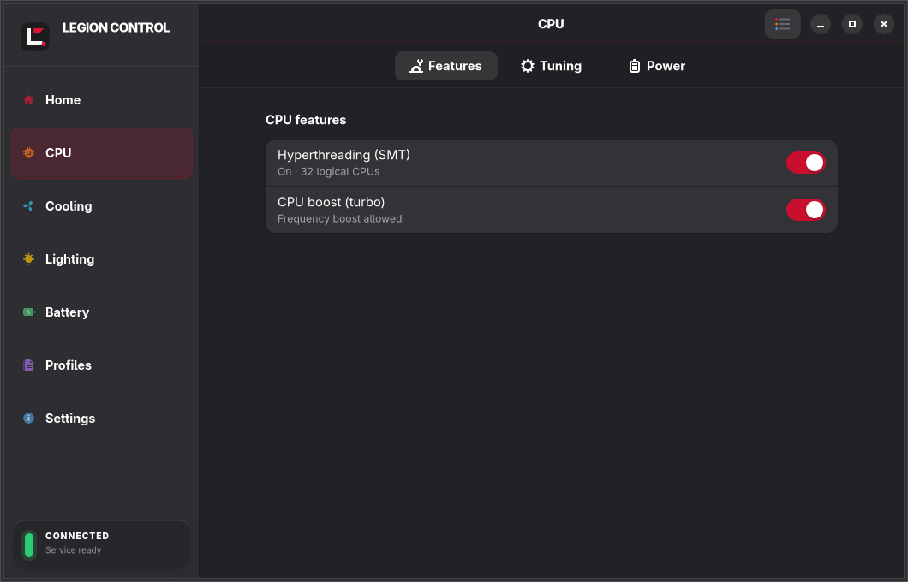</a><br><b>CPU · Features</b><br><sub>boost · SMT</sub></td>
<td align="center"><a href="docs/assets/screenshots/03-cpu-tuning.png">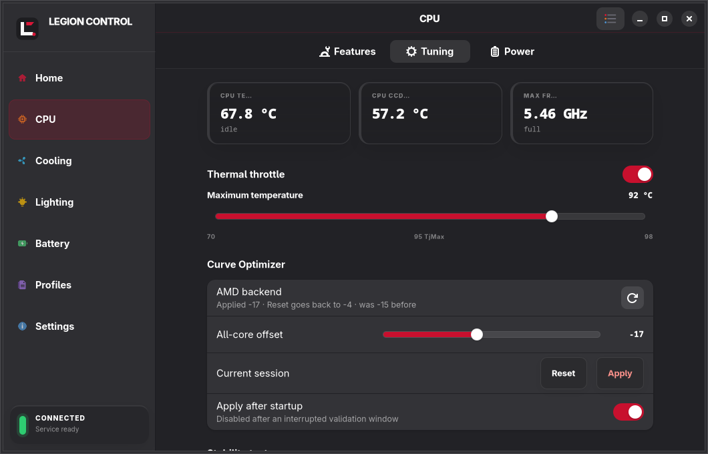</a><br><b>CPU · Tuning</b><br><sub>thermal · CO · stability</sub></td>
</tr>
<tr>
<td align="center"><a href="docs/assets/screenshots/04-cpu-power.png">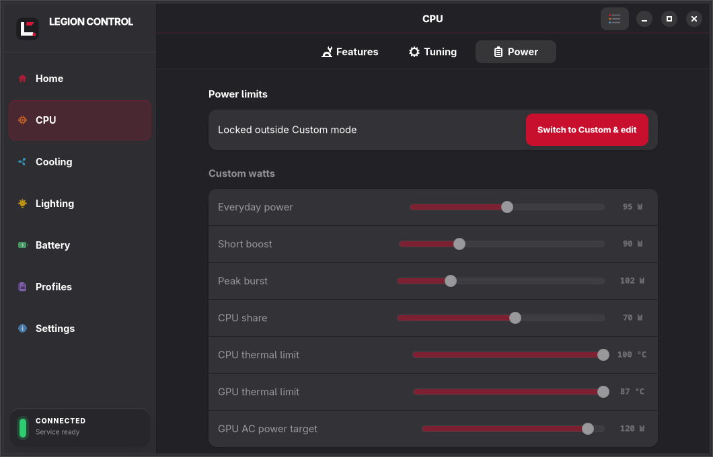</a><br><b>CPU · Power</b><br><sub>read-only PPT preview</sub></td>
<td align="center"><a href="docs/assets/screenshots/05-cooling.png"></a><br><b>Cooling</b><br><sub>all fans at a glance</sub></td>
<td align="center"><a href="docs/assets/screenshots/06-lighting-keyboard.png"></a><br><b>Lighting · Keyboard</b><br><sub>zone + per-key</sub></td>
</tr>
<tr>
<td align="center"><a href="docs/assets/screenshots/07-lighting-front.png">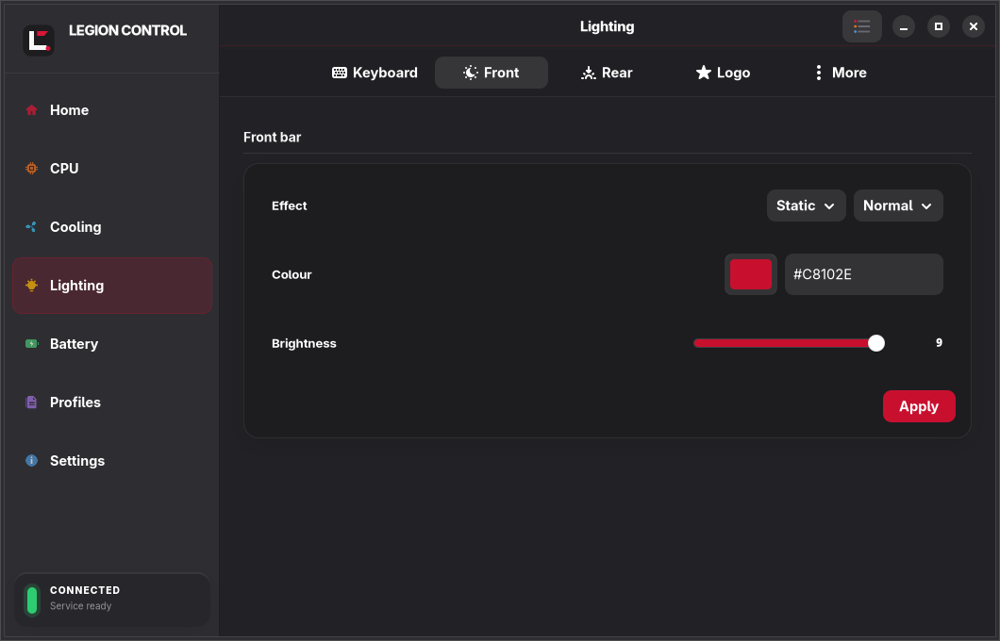</a><br><b>Lighting · Front</b><br><sub>chin bar</sub></td>
<td align="center"><a href="docs/assets/screenshots/08-lighting-rear.png">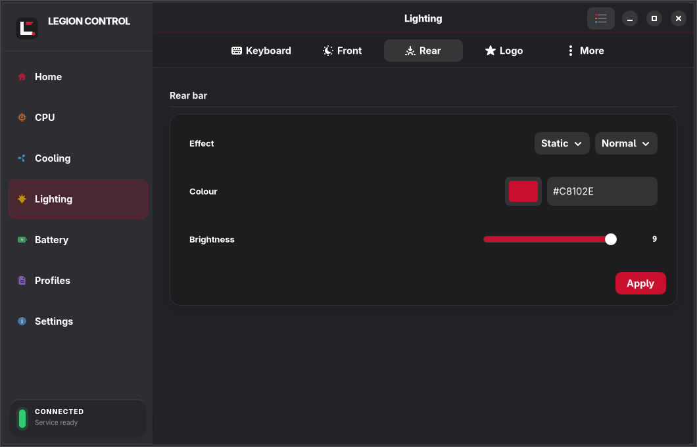</a><br><b>Lighting · Rear</b><br><sub>hinge bar</sub></td>
<td align="center"><a href="docs/assets/screenshots/09-lighting-logo.png">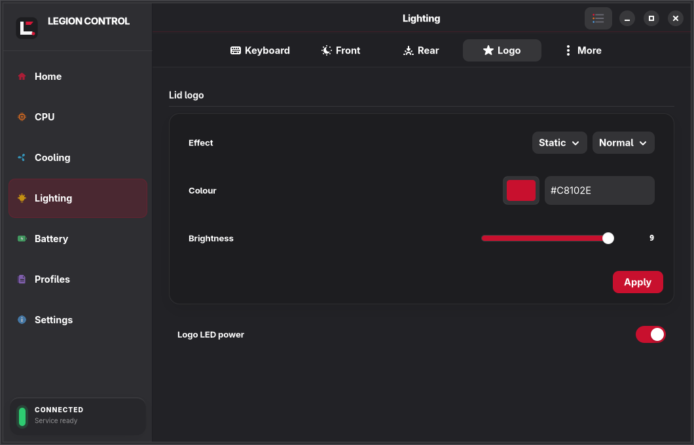</a><br><b>Lighting · Logo</b><br><sub>lid star</sub></td>
</tr>
<tr>
<td align="center"><a href="docs/assets/screenshots/10-lighting-more.png">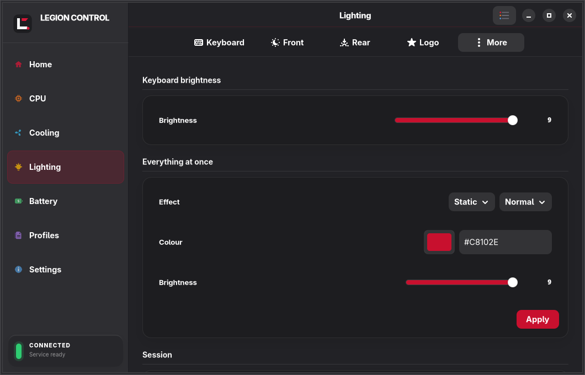</a><br><b>Lighting · More</b><br><sub>brightness · all zones</sub></td>
<td align="center"><a href="docs/assets/screenshots/11-battery.png"></a><br><b>Battery</b><br><sub>health · limit · status</sub></td>
<td align="center"><a href="docs/assets/screenshots/12-profiles.png">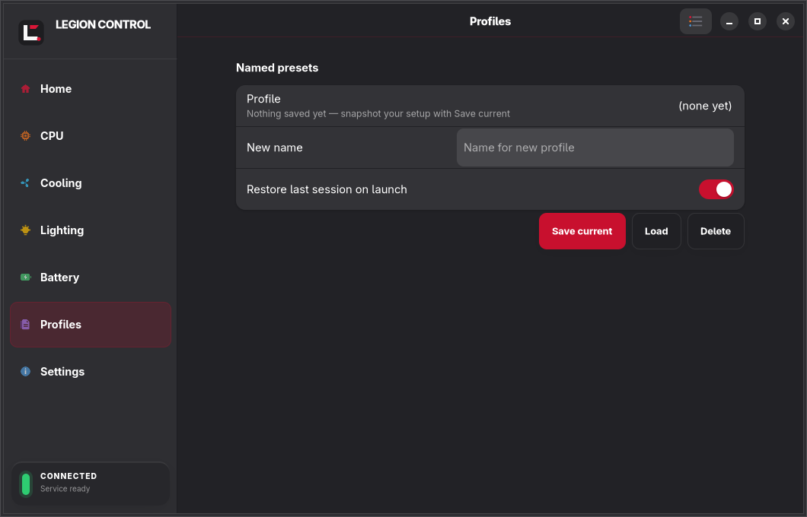</a><br><b>Profiles</b><br><sub>save · load · preset</sub></td>
</tr>
<tr>
<td align="center"><a href="docs/assets/screenshots/13-settings-setup.png">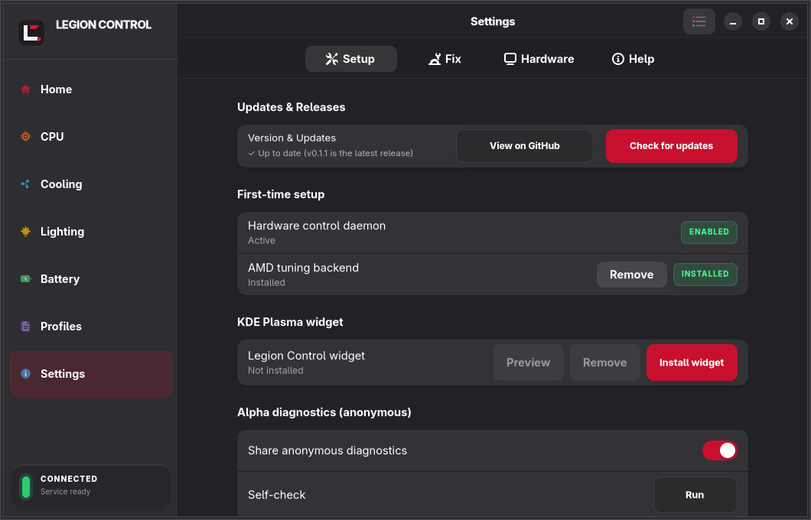</a><br><b>Settings · Setup</b><br><sub>updates · daemon · diagnostics</sub></td>
<td align="center"><a href="docs/assets/screenshots/14-settings-fix.png">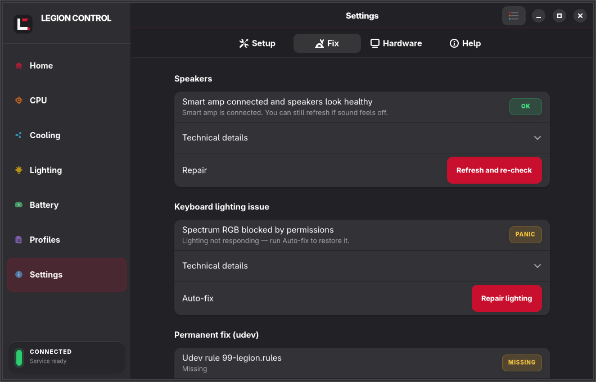</a><br><b>Settings · Fix</b><br><sub>speakers · RGB · udev · logs</sub></td>
<td align="center"><a href="docs/assets/screenshots/15-settings-hardware.png">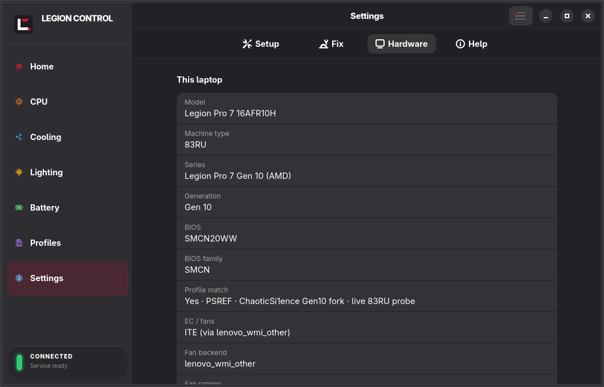</a><br><b>Settings · Hardware</b><br><sub>DMI · EC · lighting</sub></td>
</tr>
<tr>
<td align="center"><a href="docs/assets/screenshots/16-settings-help.png">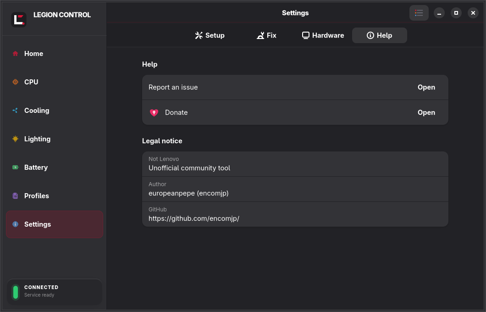</a><br><b>Settings · Help</b><br><sub>links · legal</sub></td>
<td align="center"><a href="docs/assets/screenshots/19-widget.png">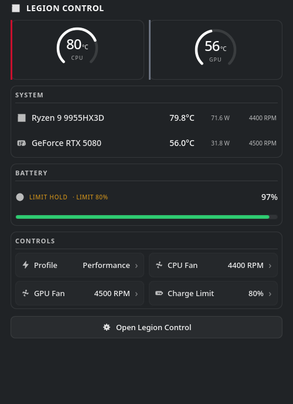</a><br><b>KDE widget</b><br><sub>gauges · controls · plasma</sub></td>
<td></td>
</tr>
</table>

<details>
<summary><b>How screenshots are taken without obscuring your workflow</b></summary>

```bash
# 1. Isolate — virtual display, no grab of your real Wayland session
Xvfb :99 -screen 0 1400x900x24 -ac &
DISPLAY=:99 openbox --sm-disable &

# 2. Run each page headless, with a private window
DISPLAY=:99 WAYLAND_DISPLAY= GDK_BACKEND=x11 GSK_RENDERER=cairo \
  LEGION_PAGE=overview legion-settings &

# 3. Capture the 1060×680 CSD window directly
WIN=$(DISPLAY=:99 xdotool search --onlyvisible --name "Legion Control")
DISPLAY=:99 xwd -id $WIN -out page.xwd
magick page.xwd page.png

# 4. Real session is untouched — the hidden tray instance is
#    briefly replaced and then restarted automatically
```

All 17 images in [`docs/assets/screenshots/`](docs/assets/screenshots/) are produced this way. Run `scripts/capture-screenshots.sh` to regenerate.

</details>

---

## Highlights

|  |  |  |
|---|---|---|
| **▸ Observe** — Home chips cross-fade on 2s polls, thermal governor 70–98°C, per-fan cards with reset | **▸ Tune** — Curve Optimizer -30..0 with live SMT/boost toggles and 5-min stability test | **▸ Light** — Spectrum 048d:c197: Keyboard / Front / Rear / Logo / More + per-key painter |
| **▸ Endure** — Battery health, 60/80/100 % limiter, charge_types vs conservation_mode reconciliation | **▸ Repair** — Fix hub: Speakers (amp), RGB panic (HID soft → USB reset → hid-generic rebind + **permanent udev**), Logs | **▸ Persist** — Profiles, autostart, `~/.config/legion-control/settings.json`, optional Plasma 6 widget |

---

## Features

- **Monitor** CPU, GPU, battery, fans, and hwmon telemetry — chips on top, details below, hover tips, `--hidden` tray autostart.
- **Control** profiles, fan targets, CPU boost, SMT, charge limits, and **CPU Tuning** — thermal throttle + Curve Optimizer undervolt + stability test on one tab.
- **Configure** Gen 10 Spectrum RGB zones, effects, brightness, logo, and per-key colors — 5 tabs + painter window.
- **Save** profiles, automate with `legion-cli`, optional Plasma 6 widget — polling via `legion-poll.sh`.

---

## Get started

The source installer supports **Ubuntu 24.04+, Fedora 40+, Arch, openSUSE Tumbleweed**. GUI needs Rust 1.87+, GTK 4.14+, libadwaita 1.5+, `libudev`, `pkg-config`, C toolchain.

```bash
git clone https://github.com/encomjp/lenovo-legion-tool.git
cd lenovo-legion-tool
./install.sh
# variants: ./install.sh -y | --user | --widget | --help
# do not mix native package + source installer — see docs/INSTALLATION.md
```

After installation:

```bash
systemctl status legion-control
legion-cli status
legion-cli info
```

---

## How it works

GUI, CLI, and widget talk to `legion-daemon` for privileged ops. Daemon merges sysfs, hwmon, battery, NVIDIA, HID; RGB uses direct HID when possible. Support varies by model/firmware/kernel.

[](docs/assets/legion-control-overview.png)

[Open as PNG](docs/assets/legion-control-overview.png) · [View SVG](docs/assets/legion-control-overview.svg) · [Read Architecture Guide](docs/ARCHITECTURE.md)

---

## Alpha telemetry (opt-out)

One anonymized JSON per minute — model/type/BIOS/CPU/GPU/EC, distro+kernel, sensors, fans, battery health, thermal/CO, settings digest, sanitized log tail, self-check — over HTTPS to private `legion-telemetry`. **On by default**; opt-out in `Setup → Alpha diagnostics` or first launch. Never: hostname, username, serials, MAC/IP. Self-hosters can set `LEGION_TELEMETRY_URL` + `LEGION_TELEMETRY_KEY`.

---

## Hardware support

Verified on **Lenovo Legion Pro 7 16AFR10H (83RU)** with Gen 10 Spectrum `048d:c197` (check with `lsusb -d 048d:c197`). `048d:c193` is a separate Lenovo controller covered by the udev rule. Other Gen 10 Legion likely compatible; older gens use different protocols. See [Hardware and HID](docs/HARDWARE-AND-HID.md).

```bash
lsusb -d 048d:c197
```

---

## Guides

- [Installation](docs/INSTALLATION.md) — prereqs, packages, installer, widget, upgrades, removal
- [Usage](docs/USAGE.md) — GUI & CLI, profiles, cooling, lighting, battery, diagnostics, logs, safety
- [Architecture](docs/ARCHITECTURE.md) — components, IPC, data flow, persistence, permissions, deployment
- [Hardware and HID](docs/HARDWARE-AND-HID.md) — Linux interfaces, HID, support boundaries, debugging
- [KDE Plasma widget](docs/WIDGET.md) — install, controls, config, validation
- [Troubleshooting](docs/TROUBLESHOOTING.md) — evidence-first fixes for install, daemon, HID, sensors, fans, dGPU, battery, widget
- [Development](docs/DEVELOPMENT.md) — toolchain, checks, packaging, hardware tests, contributions

---

## Project

Repository: <https://github.com/encomjp/lenovo-legion-tool>

Licensed under [GPL-2.0-only](https://www.gnu.org/licenses/old-licenses/gpl-2.0.html). Spectrum notes build on community reverse-engineering: [legion-spectrum-control](https://github.com/alstergee/legion-spectrum-control) and [LenovoLegionToolkit](https://github.com/BartoszCichecki/LenovoLegionToolkit).

<p align="center"><sub>Garage Lab · CachyOS · KWin Wayland · Rust + GTK4 · Made for Legion, made in Europe.</sub></p>
