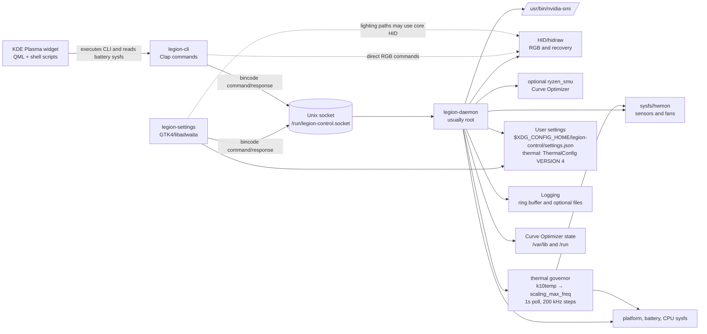
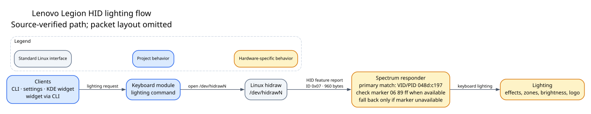

# Lenovo Legion Tool Architecture

This document describes the architecture implemented by the `lenovo-legion-tool` repository. It is based on the Rust sources, service files, udev rule, PolicyKit policy, and repository commands. The normal deployment is a root `legion-daemon` system service with unprivileged clients using a Unix socket; RGB operations additionally have a direct HID path.

## System overview

The repository builds one shared Rust library and four binaries declared in [`Cargo.toml`](../Cargo.toml):

- `legion-daemon` — the long-running hardware-control service (`src/daemon/main.rs`).
- `legion-cli` — the Clap command-line client (`src/cli/main.rs`).
- `legion-settings` — the GTK4/libadwaita desktop application (`src/settings/main.rs`).
- `legion-control-setup` — a narrowly scoped root helper for selected setup operations (`src/setup-helper/main.rs`).

The shared library is named `legion_core` and exposes the hardware, IPC, configuration, logging, and persistence modules from `src/lib.rs`.



The dashed edges are important: not every RGB operation is daemon-mediated. The CLI contains direct calls into `legion_core::keyboard` for some RGB/effect operations, while other commands use IPC.


[Overview PNG](assets/legion-control-overview.png) · [Overview DOT source](assets/legion-control-overview.dot)

For the focused user-to-hardware explanation of Linux interfaces and HID behavior, see the [Hardware and HID guide](HARDWARE-AND-HID.md).

## Runtime components

### Shared core library

`src/lib.rs` is the module map for the library:

- `audio` — speaker/AW88399 diagnosis and recovery.
- `battery` — battery telemetry, conservation mode, and charge-limit mapping.
- `comms` — Unix-socket protocol, client transport, command labels, and write classification.
- `config` — user settings and profiles stored as JSON.
- `cpu` — SMT and CPU-frequency-boost controls.
- `device` and `models` — hardware detection and model capabilities.
- `dgpu` — NVIDIA telemetry through `nvidia-smi`.
- `fans` — fan hwmon discovery, reads, and target writes.
- `keyboard` — standard keyboard controls and Spectrum HID RGB operations.
- `logging` — process logging, the in-memory ring buffer, optional file logging, and reload support.
- `profile` — platform profiles and firmware attributes.
- `rgb_panic` — RGB diagnosis, USB reset, and HID recovery.
- `sensors` — aggregation of hwmon, sysfs, battery, and dGPU readings.
- `thermal` — thermal throttle governor (`ThermalConfig`/`ThermalStatus`, `compute_target`, `validate`, `k10temp` and `scaling_max_freq` helpers).
- `undervolt` — optional AMD Curve Optimizer access and persistence.

The crate-level documentation states the intended hardware split: sensors use sysfs/hwmon, fan control uses WMI-backed hwmon interfaces, and keyboard RGB uses USB HID (`src/lib.rs`).

### Daemon

`src/daemon/main.rs` is the privileged service boundary. Its startup sequence is:

1. Initialize logging and record the effective UID and PID.
2. Register SIGINT/SIGTERM shutdown flags and a SIGHUP log-reload flag.
3. Select and bind the socket, removing an existing path first.
4. Warn when not running as root because profile, fan, and conservation writes are expected to fail.
5. Set the socket mode to `0666`.
6. Make the listener nonblocking and detect/log hardware capabilities.
7. Start the Curve Optimizer persistence worker.
8. Start the RGB watchdog thread.
9. Start the thermal governor thread (alongside the RGB watchdog).
10. Accept clients and process each connection synchronously.
11. On clean shutdown, clear the persistence armed marker and remove the socket.

The command dispatcher is `process_command` in `src/daemon/main.rs`. It maps `DaemonCommand` variants to the relevant core module and returns a `DaemonResponse`. `cmd_is_write` in `src/comms.rs` is used for logging and timing; it is not an authorization mechanism. The thermal surface is `GetThermal` → `Thermal(ThermalConfig)`, `SetThermal { enabled, max_temp, acknowledge }` → `ThermalStatus` (with `validate` `70..=98` and ack for `96–98`), and `GetThermalStatus` → `ThermalStatus`; first successful `SetThermal(enabled=true)` best-effort `systemctl disable --now cpu95-throttle.service` (warn-only) to avoid double-clamping the deprecated external service.

The accept loop handles one client at a time (`src/daemon/main.rs`). A slow hardware operation therefore occupies the daemon’s command-processing path until it returns. NVIDIA calls have a three-second response timeout, but the implementation does not retain a child-process handle to terminate a timed-out subprocess (`src/dgpu.rs`).

### CLI

`src/cli/main.rs` defines the `legion-cli` subcommands. Most commands call `comms::send_command`, including sensors, profile, fan, battery, CPU controls, logs, and Curve Optimizer operations.

The CLI also has direct hardware paths. In particular, RGB/effect commands call keyboard functionality directly in the CLI process rather than uniformly routing through the daemon. This requires access to the matching `/dev/hidraw*` node through the udev rule. The command surface includes, among others:

```bash
legion-cli status
legion-cli info
legion-cli profile
legion-cli set-profile balanced
legion-cli fan
legion-cli set-fan 1 3500
legion-cli set-fan 1 0
legion-cli battery
legion-cli charge-limit 80
legion-cli effect static 200 16 46 --zone keyboard
legion-cli rgb-status
legion-cli rgb-fix
legion-cli logs 50
legion-cli set-log-level debug
```

These command forms are defined in `src/cli/main.rs`. Fan target `0` means automatic mode (`src/fans.rs`). Thermal throttle is:

```bash
legion-cli thermal status
legion-cli thermal set --max-temp 85
legion-cli thermal set --max-temp 98 --acknowledge-high-temp
legion-cli thermal set --off
```

`thermal status` prints `Thermal: {on|off} · max {n}°C (restore {n-7}°C) · cur {freq} kHz · Tctl {t} / Tccd2 {t} · {idle|throttling}` via `GetThermalStatus`; `thermal set` validates `70..=98` (ack for `96–98` exceeds TjMax `95°C`) then sends `SetThermal` (`src/thermal.rs` / `src/cli/main.rs`).

### GTK GUI

`src/settings/main.rs` creates a GTK4/libadwaita application with application ID `com.encomjp.legion-settings`. The settings application includes overview, CPU, cooling, lighting, battery, troubleshooting, storage, and about/setup areas. Supporting modules include:

- `src/settings/lighting.rs` — lighting page and zone effects.
- `src/settings/perkey.rs` — per-key painting.
- `src/settings/queue.rs` — coalesced fan and firmware-attribute writes.
- `src/settings/tray.rs` — tray integration.
- `src/settings/widgets.rs` — common UI widgets and status helpers.
- `src/settings/style.css` — application CSS.

The GUI normally uses `send_command` for daemon operations. `src/settings/queue.rs` collects rapid slider changes, remembers fan values, waits 140 ms after the latest change, and then sends `SetFanTarget` and `SetFwAttr` commands from a worker thread. This prevents a stream of intermediate slider values from becoming individual writes.

The GUI checks daemon availability and can attempt to start the system service using, in order, `systemctl start legion-control`, `run0 systemctl start legion-control`, and `pkexec systemctl start legion-control` (`src/settings/main.rs`). PolicyKit is also used for the fixed setup helper, not as a general authorization layer for socket commands.

The Cooling page contains a **Thermal Throttle** card (`Clamp scaling_max_freq when hot`) built by `build_thermal_card` in `src/settings/main.rs`: `GtkSwitch` for `enabled`, `GtkScale` `70–98` with `Restore at {max-7}°C` label and `140 ms` debounced `SetThermal` (like `queue.rs`), warning `GtkLabel.warning` + `CheckButton "I understand"` gated to `≥96°C` (`acknowledge`), and live `Tctl`/`Tccd2`/`max_freq` chips tinted via `tint_temp` (`≥90 red, ≥78 amber`) polling `GetThermalStatus` every `2s`.

### KDE Plasma widget

The widget is under `kde-widget/package/`. Its QML entry point is `kde-widget/package/contents/ui/main.qml`; helper scripts include `legion-poll.sh`, `legion-command.sh`, `legion-info.sh`, and `legion-settings.sh`.

`legion-poll.sh` searches common installation locations for `legion-cli`, runs `legion-cli status` and `legion-cli fan`, reads battery data directly from `/sys/class/power_supply/BAT*`, and emits `KEY=value` data consumed by QML. The QML executable data source periodically runs the poller (`kde-widget/package/contents/ui/main.qml:224-240`). Thus the widget is a presentation client over the CLI, with a separate direct battery sysfs read.

### Setup helper and PolicyKit

`src/setup-helper/main.rs` is intentionally narrow. It requires effective UID 0 and accepts only:

- `install-ryzen-smu`
- `remove-ryzen-smu`
- `enable-daemon`

It uses fixed executable paths, fixed source directories, and fixed system paths. It does not evaluate shell text or accept caller-provided commands or paths (`src/setup-helper/main.rs`). The actions are associated with the PolicyKit entries in `data/polkit/com.encomjp.legion-control.policy`, which require administrator authentication for an active session.

## IPC and Unix socket

### Protocol

`src/comms.rs` defines the serialized `DaemonCommand` and `DaemonResponse` enums. The transport is a Unix domain stream using `bincode`:

1. The client tries candidate socket paths.
2. It connects and serializes one command.
3. It writes the bytes and shuts down the write side.
4. The daemon reads the command until EOF and deserializes it.
5. The daemon dispatches the command and serializes one response.
6. The client reads the response until EOF and deserializes it.

The existing command and response variant order is explicitly marked as a frozen ABI. New variants are appended rather than reordering the existing variants (`src/comms.rs`). There is no explicit protocol-version field or capability negotiation; compatibility depends on this enum-order convention and on clients recognizing parse/variant failures. The GUI reports a service as outdated for relevant parse/variant errors (`src/settings/main.rs`).

### Socket paths

For a root daemon, `bind_socket_path()` returns `/run/legion-control.socket`. For a non-root daemon, it returns `$XDG_RUNTIME_DIR/legion-control.socket` when `XDG_RUNTIME_DIR` is set, or `/tmp/legion-control.socket` when it is unset. An empty variable is not the same as unset here: it can produce a relative socket path. Clients try the system socket first and then the per-user candidate (`src/comms.rs`).

The daemon removes an existing path, binds the selected socket, and explicitly sets mode `0666` (`src/daemon/main.rs`). The repository does not implement peer-credential checks, PolicyKit checks, authentication, or command-level authorization in the socket server.

## Hardware data flow

### Sensors and hwmon/sysfs

`src/sensors.rs` discovers hwmon devices by reading `/sys/class/hwmon/*/name`, then aggregates values from known names:

- `k10temp` — CPU Tctl/TCCD temperatures.
- `legion_hwmon` — embedded-controller CPU/GPU temperatures and a supported fan backend.
- `amdgpu` — iGPU temperature and power.
- `nvme` — SSD temperatures.
- `spd5118` — RAM temperatures.
- `iwlwifi_1` — Wi-Fi temperature.
- `r8169` variants — Ethernet temperature.
- `lenovo_wmi_other` — fan RPM and target channels in the sensor aggregation path.

The dGPU values are obtained separately through `src/dgpu.rs`. Battery values are read from `/sys/class/power_supply/BAT0`, including capacity, status, voltage, cycle count, and charge type. The platform profile is read from `/sys/firmware/acpi/platform_profile` (`src/sensors.rs`).

CPU package power uses two samples of `/sys/devices/virtual/powercap/intel-rapl/intel-rapl:0/energy_uj` (`src/sensors.rs`). If that path is unavailable or cannot be parsed, the function returns `0.0`; this is an unavailable reading, not a measured zero. The path is Intel-specific even though the project also targets AMD systems; this is an implementation limitation, not evidence that an AMD power source is present.

### Fans

`src/fans.rs` prefers a `lenovo_wmi_other` hwmon device and falls back to `legion_hwmon`. It forms paths such as:

```text
/sys/class/hwmon/hwmonX/fan1_input
/sys/class/hwmon/hwmonX/fan1_target
```

`read_rpm`, `read_target`, `read_min`, and `read_max` read the corresponding files. `set_target` writes the requested RPM to `fanN_target`; `0` selects automatic mode. The UI-facing `rpm_label` displays `Auto` when the target and reported RPM are both zero (`src/fans.rs`).

### Platform profiles and firmware attributes

`src/profile.rs` uses ACPI platform-profile files, platform-profile class files, and firmware-attribute paths. The daemon’s `SetFwAttr` handler only accepts attribute names beginning with `ppt_` or `gpu_nv_` and parses the value as `u32` (`src/daemon/main.rs`). This is a name/value boundary in the daemon; the underlying file operations are implemented by `src/profile.rs`.

### Battery and charge limits

`src/battery.rs` primarily reads `/sys/class/power_supply/BAT0`. Conservation-mode discovery uses a known Lenovo path and a fallback scan under `/sys/bus/platform/drivers/ideapad_acpi`. The effective charge-limit API maps inputs into three firmware modes:

- `0..=69` → 60% conservation mode.
- `70..=89` → 80% `Long_Life` charging type.
- `90+` → 100% standard charging.

The implementation writes the relevant `conservation_mode` and/or `charge_types` files (`src/battery.rs`).

### NVIDIA dGPU

`src/dgpu.rs` invokes the absolute path `/usr/bin/nvidia-smi` with CSV, no-header, no-unit queries. It reads GPU name, temperature, power draw, graphics clock, utilization, and power limits through the helper functions. Each call waits up to three seconds. If unavailable, sensor aggregation uses `-1.0` for dGPU temperature, power, and clock so the UI does not render unavailable data as zero (`src/sensors.rs`).

### HID and RGB

`src/keyboard.rs` scans `/sys/class/hidraw`, follows each device link, matches vendor `048d` and product `c197`, and checks the report descriptor for the Spectrum usage when available. It then opens `/dev/hidrawN` read/write and sends HID feature reports through ioctl. A process-local mutex serializes Spectrum access.

The implementation supports zone effects, whole-keyboard effects, per-key maps, brightness, logo controls, and RGB panic diagnosis/recovery. The udev rule `data/udev/99-legion.rules` grants mode `0666` plus `uaccess` to matching `048d:c193` and `048d:c197` hidraw devices. This enables non-root direct RGB access, but it also makes those device nodes broadly accessible.

RGB panic recovery (`src/rgb_panic.rs`) can inspect HID/kernel state, change sysfs permissions, reset USB, and unbind/rebind the HID driver. The daemon starts a watchdog thread in `src/daemon/main.rs`; its detailed loop and cooldown behavior are implemented there.



[HID lighting flow PNG](assets/hid-lighting-flow.png) · [HID lighting flow DOT source](assets/hid-lighting-flow.dot)

For report-size, device-matching, and `hidraw` troubleshooting context, see the [Hardware and HID guide](HARDWARE-AND-HID.md).

### Thermal Throttle governor

`src/thermal.rs` exposes the pure core: constants `MAX_FULL 5_460_527` / `MIN 4_600_000` / `STEP 200_000` / `HYSTERESIS 7` / `INTERVAL 1s`, `ThermalConfig { enabled, max_temp: 70..=98 default 90 }` and `ThermalStatus { config, cur_max_freq, tctl_mC, tccd2_mC, active, restore_temp }`, plus `validate`, `compute_target(cur_max, temp_mC, &cfg) -> Option<u32>`, and hwmon helpers `read_thermal_temps()` (`k10temp` `temp1_input` / `temp4_input` fallback `temp3_input` in milli-°C), `read_cur_max()` (`cpu0/cpufreq/scaling_max_freq`), `write_all_cpus(freq)` (`cpu[0-9]*/cpufreq/scaling_max_freq`). The `thermal-governor` thread in `src/daemon/main.rs` shares `Arc<RwLock<ThermalConfig>>` + `Condvar` with the `SetThermal` handler, samples `max(Tctl,Tccd2)` vs `max_temp`/`restore = max-7`, steps `compute_target` (`≥max` throttle / `≤restore` restore), writes via `write_all_cpus` with `info!`/`warn!` logging, sleeps `1s` when enabled (else `10s`/`Condvar::wait_timeout`), and respects `shutdown`. `96–98°C` requires `acknowledge=true` because it exceeds TjMax `95°C`. `cpu95-throttle.service` is deprecated: first `enabled=true` best-effort `systemctl disable --now` it.

### Optional Curve Optimizer

`src/undervolt.rs` accesses the optional `ryzen_smu` sysfs interface:

```text
/sys/kernel/ryzen_smu_drv
/sys/kernel/ryzen_smu_drv/smu_args
/sys/kernel/ryzen_smu_drv/rsmu_cmd
```

The module documents that the daemon is the intended caller. Writes are capability-gated by a read-only probe, limited to offsets `-30..=0`, and verified by reading all 16 cores (`src/undervolt.rs`). The implementation has strict hardware checks for the supported target before applying this feature.

## Persistence and logging

### User configuration

`src/config.rs` stores application settings at:

```text
$XDG_CONFIG_HOME/legion-control/settings.json
```

or, when `XDG_CONFIG_HOME` is unset:

```text
$HOME/.config/legion-control/settings.json
```

The settings store is process-local (`OnceLock<Mutex<AppConfig>>`). Loading a missing or invalid file falls back to defaults; updates serialize and write the JSON file after creating its parent directory. The stored application state includes lighting, per-key colors, brightness, logo state, charge limit, keyboard layout, restore-on-launch state, last-session power fields, named profiles, welcome-dialog state, and `thermal: ThermalConfig` (`VERSION 4`, `#[serde(default)]` → `enabled=false, max_temp=90` for old files) as defined by `AppConfig` in `src/config.rs`. `src/thermal.rs` documents the stepping constants and validation.

The ordinary GUI settings file is user-scoped. The source does not show the root daemon loading this file, so ordinary restore-on-launch behavior should be treated as application/UI-owned. This is separate from system-wide Curve Optimizer persistence.

### Curve Optimizer persistence

The Curve Optimizer paths are:

```text
/var/lib/legion-control/curve-optimizer.json
/var/lib/legion-control/curve-optimizer.armed
/run/legion-control/curve-optimizer-baseline.json
```

Startup reapplication is delayed by 60 seconds and followed by a five-minute validation window. The armed marker is used for crash/recovery handling; a clean shutdown clears it. The persistence configuration is system-wide and distinct from `settings.json` (`src/undervolt.rs`).

### Logs

`src/logging.rs` maintains an in-memory ring buffer with a default capacity of 500 and a maximum of 2000 entries. Optional file logging is enabled with `LEGION_LOG_FILE=1`; the data directory is normally under the process user's `~/.local/share/legion-control`, so a root service often writes under `/root/.local/share/legion-control` while GUI logs remain user-scoped. The daemon exposes recent entries and runtime log-level changes through `GetRecentLogs` and `SetLogLevel`; clients should prefer `legion-cli set-log-level` for a running daemon. `SIGHUP` reloads the daemon's inherited environment log filter and does not alter the service unit environment.

## Permissions and security boundaries

### Privileged daemon boundary

The intended root daemon writes or controls privileged resources including platform profile sysfs, fan targets, charge controls, CPU SMT/boost, firmware attributes, USB/HID recovery paths, and optional Curve Optimizer interfaces. The daemon explicitly warns when started non-root (`src/daemon/main.rs`).

The repository contains two system-service definitions:

- `data/systemd/legion-control.system.service` — manual/source installation, `ExecStart=/usr/local/bin/legion-daemon`.
- `packaging/common/legion-control.service` — packaged installation, `ExecStart=/usr/bin/legion-daemon`, with `DeviceAllow`, `ProtectHome=read-only`, `PrivateTmp=true`, `NoNewPrivileges=true`, and `ProtectSystem=false`.

Consequently, service hardening and the installed executable path depend on the installation method. The two units should not be treated as identical deployments.

### Socket boundary

The root daemon’s `/run/legion-control.socket` is explicitly mode `0666`. Because the server does not inspect peer credentials or invoke PolicyKit for ordinary commands, a local process able to connect can submit the daemon’s serialized command surface, including hardware writes. `cmd_is_write` only labels/logs mutating commands. This is the most important security property of the current IPC implementation: root execution is not paired with per-client authorization.

### HID boundary

`data/udev/99-legion.rules` also uses `MODE="0666"` for the supported Lenovo HID products, with `TAG+="uaccess"`. This is consistent with the direct non-root RGB path, but it allows any local user with access to the node to attempt HID operations directly.

### PolicyKit boundary

PolicyKit applies to the setup helper actions in `data/polkit/com.encomjp.legion-control.policy`, not to ordinary daemon commands. The helper narrows its own interface to three fixed operation names and fixed paths. It does not make the world-writable daemon socket safe or add authorization to hardware IPC.

## Installation and operational commands

The repository’s primary build command is:

```bash
cargo build --release
```

The source installer is:

```bash
./install.sh
```

The README also documents non-interactive installation and optional components:

```bash
./install.sh -y
./install.sh --user
./install.sh --widget
./install.sh --with-ryzen-smu
```

The normal system-service commands shown by the repository are:

```bash
sudo systemctl enable --now legion-control
sudo systemctl restart legion-control
sudo journalctl -u legion-control -f
```

After rebuilding, the documented manual refresh copies the three main binaries and restarts the service:

```bash
sudo systemctl stop legion-control
sudo cp target/release/legion-daemon /usr/local/bin/legion-daemon
sudo cp target/release/legion-cli /usr/local/bin/legion-cli
sudo cp target/release/legion-settings /usr/local/bin/legion-settings
sudo systemctl start legion-control
```

For udev changes, the README and installer use:

```bash
sudo udevadm control --reload-rules
sudo udevadm trigger
```

Useful source-backed inspection commands include:

```bash
ls -l /run/legion-control.socket
find /sys/class/hwmon -maxdepth 2 -type f | sort
cat /sys/class/dmi/id/product_name
cat /sys/class/dmi/id/product_version
lsusb | grep 048d
ls -l /dev/hidraw*
/usr/bin/nvidia-smi -L
/usr/bin/nvidia-smi --query-gpu=name,temperature.gpu,power.draw --format=csv
legion-cli logs 50
legion-cli rgb-status
```

## Source map

| Area | Primary paths | Responsibility |
|---|---|---|
| Build targets | `Cargo.toml` | Library and four binaries; dependencies and release profile |
| Shared module map | `src/lib.rs` | Exports core hardware, IPC, configuration, logging, and persistence modules |
| IPC | `src/comms.rs` | `DaemonCommand`, `DaemonResponse`, socket selection, bincode client |
| Daemon | `src/daemon/main.rs` | Socket server, lifecycle, dispatch, watchdog startup, signal handling |
| CLI | `src/cli/main.rs` | Clap commands, daemon calls, selected direct RGB calls |
| GTK GUI | `src/settings/main.rs` | GTK4/libadwaita application, daemon gate, service start fallback |
| GUI write coalescing | `src/settings/queue.rs` | 140 ms fan/firmware-attribute write queue |
| GUI lighting | `src/settings/lighting.rs`, `src/settings/perkey.rs` | Zone effects and per-key UI |
| Sensors | `src/sensors.rs` | hwmon/sysfs aggregation and CPU power sampling |
| Fans | `src/fans.rs` | WMI/hwmon fan discovery and target writes |
| Profiles/firmware | `src/profile.rs` | Platform-profile and firmware-attribute operations |
| Battery | `src/battery.rs` | BAT0 telemetry and charge-limit mapping |
| NVIDIA | `src/dgpu.rs` | `/usr/bin/nvidia-smi` queries and timeout |
| Keyboard/RGB | `src/keyboard.rs` | HID discovery, feature reports, RGB, brightness, logo |
| RGB recovery | `src/rgb_panic.rs` | Diagnosis, USB reset, HID recovery |
| Thermal throttle | `src/thermal.rs`, `src/daemon/main.rs:thermal_governor` | `ThermalConfig`/`ThermalStatus`, `compute_target`/`validate`, `thermal-governor` thread; `k10temp` → `scaling_max_freq` |
| Curve Optimizer | `src/undervolt.rs` | `ryzen_smu`, validation, baseline, persistence |
| Configuration | `src/config.rs` | User JSON settings and profiles |
| Logging | `src/logging.rs` | Ring buffer, optional files, retention, runtime reload |
| Setup helper | `src/setup-helper/main.rs` | Fixed PolicyKit-authorized setup operations |
| Service definitions | `data/systemd/`, `packaging/common/legion-control.service` | Manual and packaged daemon units |
| Device permissions | `data/udev/99-legion.rules` | hidraw and debugfs permissions |
| PolicyKit | `data/polkit/com.encomjp.legion-control.policy` | Setup-helper authorization actions |
| KDE widget | `kde-widget/package/` | QML UI and CLI/sysfs polling scripts |
| Desktop entry | `data/gui/com.encomjp.legion-settings.desktop` | GUI launcher metadata |

## Implementation uncertainties and deployment caveats

The following points are visible in the source and should be considered when operating or extending the project:

1. The system socket is world-writable (`0666`) and has no peer authorization.
2. Supported hidraw nodes are also configured as `0666`, intentionally enabling direct RGB but broadening device access.
3. The manual and packaged systemd units differ in executable path and hardening directives.
4. The non-root socket path exists, but the daemon warns that the principal profile/fan/conservation writes will fail when not root.
5. Ordinary GUI settings are user-scoped, while Curve Optimizer persistence is system-wide; the source does not show the daemon consuming the ordinary GUI JSON.
6. Some RGB operations bypass the daemon, so behavior and permissions differ between CLI/GUI direct HID paths and daemon-mediated paths.
7. A timed-out `nvidia-smi` call returns control to the caller but does not explicitly kill the worker’s child process.
8. CPU power sampling is tied to the Intel RAPL path and reports an unavailable reading as `0.0` when the path cannot be read.
9. IPC has no explicit version negotiation; compatibility relies on preserving enum variant order and appending variants.
10. The daemon removes an existing selected socket path before binding without first proving that the path is a stale socket.
11. The source service files do not provide the same sandboxing/device restrictions across manual and packaged installs.

These are implementation observations rather than proposed behavior changes. Hardware-dependent commands still depend on the host’s hardware, permissions, installed service, and drivers.

## References

- [`Cargo.toml`](../Cargo.toml)
- `src/lib.rs`
- `src/comms.rs`
- `src/daemon/main.rs`
- `src/cli/main.rs`
- `src/settings/main.rs`
- `src/settings/queue.rs`
- `src/sensors.rs`
- `src/fans.rs`
- `src/battery.rs`
- `src/profile.rs`
- `src/dgpu.rs`
- `src/keyboard.rs`
- `src/rgb_panic.rs`
- `src/undervolt.rs`
- `src/thermal.rs`
- `src/config.rs`
- `src/logging.rs`
- `src/setup-helper/main.rs`
- `data/systemd/legion-control.system.service`
- `packaging/common/legion-control.service`
- `data/udev/99-legion.rules`
- `data/polkit/com.encomjp.legion-control.policy`
- `kde-widget/package/`
- `README.md`
- `install.sh`


